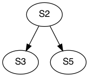
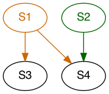

====================================
Program Dependence Graphs in PIRATE
====================================

Introduction
-------------

A Program Dependence Graph (PDG) is a *program representation* that conveys
both data and control dependencies. In a PDG, nodes are usually instructions
and edges between these nodes indicate some form of dependence. Edges can
represent a data dependence, control dependence, or call dependence. A PDG
can be built by building the Control Dependence Graph (CDG) and Dependence
Graph (DDG) independently, and then combining the results. The CDG captures
the control dependencies within the program while the DDG captures the data
dependencies. Recent research has leveraged PDGs to aid in
*program slicing*, which is the process of "slicing" an existing (usually
monolithic) program into separate partitions. Slices of a program can be
identified by disjoint partitions in the PDG. If a partition *A* of a PDG is
disjoint from another partition *B*, then the instructions contained within
should not have any control or data dependencies. This means they can run
orthogonally, or alternatively phrased, in their own PIRATE enclaves. Program
Dependence Graphs have other applications, such as finding program
dependencies for the sake of parallelization or optimization of code.

Control Dependence Graph
+++++++++++++++++++++++++

The following code excerpt shows a control dependence between statement
``S1`` and statement ``S2``. Statement ``S2`` is *control dependent* on
statement ``S1`` because ``S2`` will only execute if ``S1`` is false.

.. code-block:: language

    S1      if x > 2 goto L1 
    S2      y := 3 
    S3  L1: z := y + 1
    
Alternately phrased, ``S1`` is *not* post-dominated by ``S2``, meaning there
is a path from ``S1`` to the end of the program that does not involve ``S2``.
This fact will be leveraged when implmenting the construction of the CDG. A
simple way to find the basic blocks that are control dependent on some block
``B1`` is to traverse all successive basic blocks of ``B1`` and mark them if
they do
*not* post-dominate block ``B1``.
Though control flow dependencies can be expressed at the basic block
granularity, the nodes of the CDG will be instructions. This is because the
resulting PDG will have instructions as nodes, and control flow queries will
likely be made over instructions rather than basic blocks. Any algorithm used
for constructing a CDG using basic blocks can be trivially extended to use
instructions instead. The process simply involves adding edges from the
terminator instruction (typically an if-condition predicate) of the "from"
block to all instructions in the "to" block.

An edge in the CDG from vertex *u* to vertex *v* indicates that *u*
**influences** *v*, or that *v* is control dependent on *u*. As an example, a
segment of code and the corresponding CDG are provided below:

.. code-block:: c

    S1      x = 10
    S2      if (x == 10)
    S3          x = x + 1;
    S4      else 
    S5          x = x - 1;

Data Dependence Graph
++++++++++++++++++++++

Fundamentally, a data dependence exists between two instructions when one
instruction uses some piece of data that was modified by the other. The
following excerpt shows a naive data dependence between statements ``S1`` and
``S2``.

.. code-block:: language

    S1      x := 10 
    S2      y := x

More complicated data dependence relationships exist in languages that
contain pointers (C and C++ for example). For instance, a slightly more
involved data dependence exists between ``S3`` and ``S4`` in the following
code:

.. code-block:: c

    S1      unsigned int * p = 0x12345678;
    S2      unsigned int * q = 0x12345678;
    S3      *p = 1;
    S4      read(q);

Due to potentially complicated memory aliasing relationships, a points-to
analysis is required to find some of these non-obvious dependencies. Our
implementation will heavily rely on the existing Data Dependence Graph in
LLVM-10. More information can be found here:
https://llvm.org/docs/DependenceGraphs/index.html.

Purpose
--------

Within the context of PIRATE, Program Dependence Graphs will aid in the task
of *intraprocedural conflict identification*. Conflicts are defined as
program points that contain dependencies (data or control) from *more than
one* domain. As a motivating example, we can think of two
different domains: orange and green. Each of these domains has a different
responsibility. The orange domain could be responsible for retrieving GPS
coordinates and the green domain could be responsible for filtering them. A
monolithic application that achieves this task could look like the following:

.. code-block:: c

    S1      GPS * gps = new GPS();           __pirate_enclave(orange)
    S2      Filter * filter = new Filter();  __pirate_enclave(green)
    S3      gps->get_coords();
    S4      filter->redact(gps);

Here, the ``redact`` method takes two parameters: a reference to a ``Filter``
object and a reference to a ``gps`` object. Since these two objects originate
from different enclaves (as marked by the ``__pirate_enclave`` attributes) a
conflict exists. This conflict can be found by using a Program Dependence
Graph. The following diagram shows the Program Dependence Graph of the above
program:

The data dependencies are marked in the colors corresponding to the
originating enclave. There aren't any control dependencies because the
program has a flat structure. ``S4`` is data-dependent on ``S1`` because of
the ``gps`` parameter and is data-dependent on ``S2`` because of the hidden
``this`` parameter (``filter``). In order to find conflicts the enclave
annotations need to be
*propagated* to the correspondingly dependent nodes. In this example, both
the orange and green domains are propagated to ``S4`` from ``S1`` and ``S2``
respectively. This is done by following the data dependency edges in the PDG
accordingly.

Because a conflict was identified in the above program, it is not trivially
partitionable. The call to ``filter`` will need to be translated to an
Interprocess Communication (IPC) call, so that the two domains (enclaves) can
run orthogonally. The strategy for performing the domain isolation is
separate from the use of the PDG for *identifying* conflicts, so it will not
be covered in this document.

Implementation
---------------

The Program Dependence Graph in PIRATE LLVM leverages the pre-existing Data
Dependence Graph implementation.  Official Documentation for the Data
Dependence Graph implementation can be found `here
<https://llvm.org/docs/DependenceGraphs/index.html>`_.  The Program
Dependence Graph implementation builds on top of the builder design pattern
illustrated in the above documentation.  A new `PDGBuilder` was added which
implements a post-dominance frontier algorithm for deriving control
dependencies. The algorithm is pretty straightforward.  It simply uses the
existing `PostDominanceAnalysis` to identify which basic blocks post-dominate
each other. If basic block B is a follower of basic block A and does *not*
post-dominate it, then basic block B is control dependent on basic block A.
This algorithm was also outlined in the above documentation. One key design was
to not implement a separate `ControlDependenceGraph` class. This decision was
made because the code for finding the control dependencies is pretty simple and
did not seem to warrant an entirely separate class. This decision can easily be
changed by adding a `CDGBuilder` class which determines the control
dependencies and is then used by the `PDGBuilder`. The current Program
Dependence Graph is an *intraprocedural* analysis pass, and thus does not
currently capture *interprocedural* dependencies. 

Below is an example illustrating the compiler flags used to invoke the pass:

1. Compile source code into LLVM bitcode:

    .. code-block:: RST
    
        <PIRATE LLVM PATH>/clang -S -emit-llvm example.c

2. Run PDG analysis pass (warning: a new dot file will be created for each
   *function* since the pass is intraprocedural):
    
    .. code-block:: RST
    
        <PIRATE LLVM PATH>/opt -passes="dot-pdg" example.ll

3. Convert dot file to something nicer to look at:

    .. code-block:: RST
    
        dot -Tpng main.dot -o main.png

   Here's an example output. The red edges are data dependencies. The blue edges are control dependencies. Each node is an LLVM IR instruction.

   .. image:: main.png 
      :align: center

References
-----------
