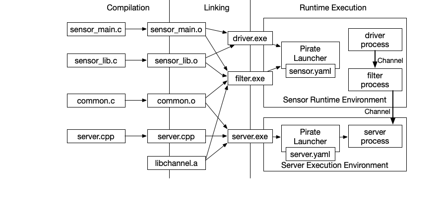

The Pirate Framework
^^^^^^^^^^^^^^^^^^^^

Overview
========

Pirate is a set of technologies for making it easier to develop,
configure, and maintain real-time secure distributed applications.

Pirate is under active development.  The main features in the
current release include:

 * A modified C compiler and linker for building multiple-enclave
   partitioned applications out of a single source file.  The extensions
   include a capability model for ensuring code runs in the correct
   operating environment.

 * A low-level communication channel library that abstracts over a
   variety of different hardware communication channels.

The next release will include a resource management framework
to make a consistent interface for system integrators to configure
enclaves built using the PIRATE technology.  Later releases will
include plugins to integrate PIRATE into the VSCode environment
and tools for debugging and profiling applications.

Pirate Workflow
-----------------

The process for developing applications using Pirate is similar to
existing methodologies for developing standalone applications, but with
baddition that multiple executables may be produced from the same set of
source files, and executables may be launched from a configuration
file that simultaneously launches and configures several executables.

As an example, we show below a diagram illustrating a Pirate system
consisting of three enclaves running in two execution environments.
The source files are shown in the left of the diagram, and arrows show
how object files and then executables are constructed.  On the
right-hand side we show how executables can be grouped into common
execution environements.

In this diagram, the three enclaves correspond to a device driver that
reads from a sensor, a filter that processes sensor data to compute a
state estimation, and a server process on a separate machine that may
further aggregrate state estimates.  Although separate runtime
components, there may be considerable overlap in the underlying
libraries used to implement each component.

Additional information about Pirate is in the sections below:

.. toctree::
   :maxdepth: 2
   :caption: Contents:

   enclave_overview
   building_applications
   elf_extensions
   unidirectional_channels
   timestamp_demo
