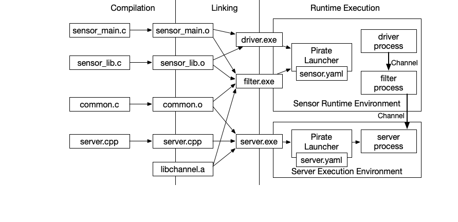

The Pirate Framework
^^^^^^^^^^^^^^^^^^^^

Overview
========

Pirate is a set of technologies designed to let developers build
applications and systems out of a set of services that communicate via
channels.  These services will be sandboxed to ensure they can
communicate using approved channels, but not unintentionally interfere
with each other.  Furthermore, we want to facilitate the development
of system architectures that are resilient to attacks and can still
prevent data breaches or loss of integrity even if some of the
underlying services are compromised.

The key technologies that are currently part of Pirate include:

 * A set of attributes and pragmas to associate code with individual
   enclaves that host services, and extensions to the LLVM compilation
   and linking tools to support these annotations.

 * A lightweight resource management framework that lets developers
   export variables associated with externally visible enclave
   resources such as communication channels, and an application
   launcher that initializes these resources to a particular platform
   configuration based on the ultimate execution environment.

 * A communication channel library that abstracts over different
   hardware communication channels.

In addition to these core components, we plan to extend development
tools, debugging tools, and IDEs to better support developers of
Pirate applications.

This technology should be usable across multiple enclave technologies,
and make it easy for system developers to change how multi-enclave
code is mapped into the physical hardware architecture.  Spliting a
given capability across enclaves will almost always require developer
involvement, but mapping multiple enclaves defined in the source code
to the same physical proceessor will not require changes to the
application.  Furthermore, we envision that on many hardware enclave
technologies developers or system admistrators will have the ability
to insert transformations such as filters between enclaves without
changing the application logic.

An extensible attribute system will be provided so that the developers
can annotate that environment requirements.  For example, the code may
require specific features are available in the hardware prior to
execution or that certain code or data is highly sensitive, and not
for disclosure to untrusted hardware or software.  This will allow the
build process and deployment tools to check that required hardware is
available in the system during the application build process, or
during deployment for software designed to run in multiple
environments.

The Pirate language extensions are designed to facilitate the
development of multi-enclave systems via common interfaces and modest
compiler extensions to support annotations.  These annotations will
not prevent buffer overflows, return-oriented-programming exploits or
other security vulnerabilities in application code.  Rather they are
intended to help developers decompose applications into multiple
computing enclaves that may be isolated from each other via physical
isolation boundaries, virtual machines or processor-specific
technologies such as Intel SGX and ARM TrustZone.

Pirate Workflow
-----------------

The process for developing applications using Pirate is similar to
existing methodologies for developing standalone applications, but with
baddition that multiple executables may be produced from the same set of
source files, and executables may be launched from a configuration
file that simultaneously launches and configures several executables.

As an example, we show below a diagram illustrating a Pirate system
consisting of three enclaves running in two execution environments.
The source files are shown in the left of the diagram, and arrows show
how object files and then executables are constructed.  On the
right-hand side we show how executables can be grouped into common
execution environements.

In this diagram, the three enclaves correspond to a device driver that
reads from a sensor, a filter that processes sensor data to compute a
state estimation, and a server process on a separate machine that may
further aggregrate state estimates.  Although separate runtime
components, there may be considerable overlap in the underlying
libraries used to implement each component.

Additional information about Pirate is in the sections below:

.. toctree::
   :maxdepth: 2
   :caption: Contents:

   enclave_overview
   resources
   building_applications
   elf_extensions
   unidirectional_channels
   timestamp_demo
